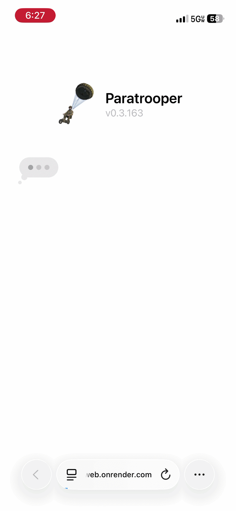

<p align="center">
  <picture>
    <source media="(prefers-color-scheme: dark)" srcset="tools/readme-header/paratrooper-header-dark.png">
    
  </picture>
</p>

## About

Paratrooper allows you to interact with your agent on the cloud
using ~~an iMessage-like~~ a familiar messaging interface. 

Once you set up your agent on the cloud, you can access paratrooper's texting interface as a PWA on your iphone.

You can use your paratrooper instance as a simple chatbot or make it more functional by embedding it in your automations. I use mine to update the [pin board on my website](https://theonetrueakash.com/).

Integrating an agent into iMessage costs >$200-1000/month. Building an agent around a modern, pleasant UI interface should not be that costly!

IMAGE

## Set up

**Current pre-requisites:**
- Render account with credits
- Claude code subscription
- An iOS-device

The fastest way to set up your paratrooper is by cloning the repo and running the installation command:
```
git clone https://github.com/AsteroidHunter/paratrooper
cd paratrooper
./install.sh
```
The basic version will run a headless claude code instance on Render. You need not have anything pre-installed; the installer will walk you through the whole set up even if you do not have python, Claude Code, or a Render account.

You are encouraged to customize your set up by providing the agent with custom tools or plugging it into existing automations. 

Once the backend portion is wired up, visit your server's address, and you will see the following page:

<p align="center">
  
</p>

After adding the paratrooper web app to your home screen, you will be able to access and use it like any other application!

## Security, limitations, & future updates
- **How much does it cost?** Cost of hosting the agent on Render with worker sleeping is not terrible (~$5-$10/month). Support for self-hosting on non-Render servers will be included in the next release which will reduce that cost to $0.
- **Can I use it on Android or my laptop?** Yes, but it may be buggy. The PWA was tested and QA-ed exclusively on an iPhone. Once hosted, you access the web app using Safari or Chrome on non-iOS devices.
- **Are harnesses besides Claude Code supported?** Not yet, but codex support will be added in the next update. 
- **How safe is this set up?** Safe for day-to-day usage. I tried sandboxing the agent, but Render doesn't allow bubblewrap, so sandboxing will be available for non-Render set ups. The basic agent has no shell, so this only matters if you give yours one. Other security measures in place include: 
  -  Your paratrooper instance is password gated
  - Service credentials are removed from the agent’s launch environment and app tokens are redacted from logs
  - Messages are shown as plain text and never run as code
  - The app only runs its own scripts and only talks to its own server
  - Other websites can't embed the app inside their own pages

## License

Paratrooper is released under the [Paratrooper License 1.0.0](LICENSE.md). It is source-available, not open source: personal, non-commercial use is permitted, the source may be shared with changes, and the software or works based on it may not otherwise be distributed.
